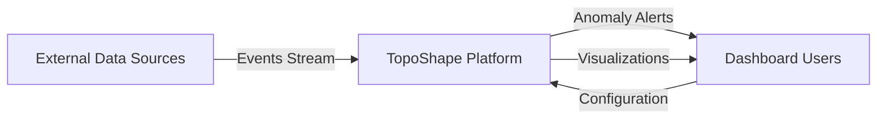
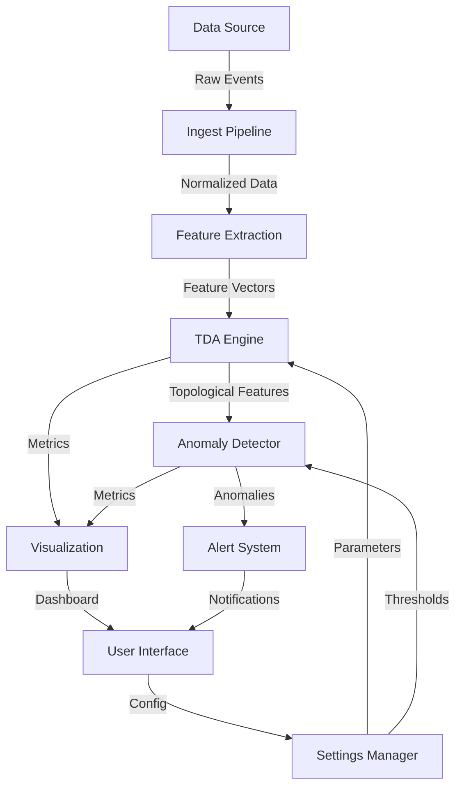
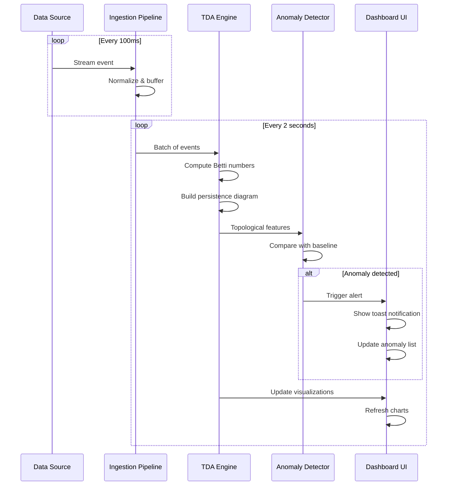
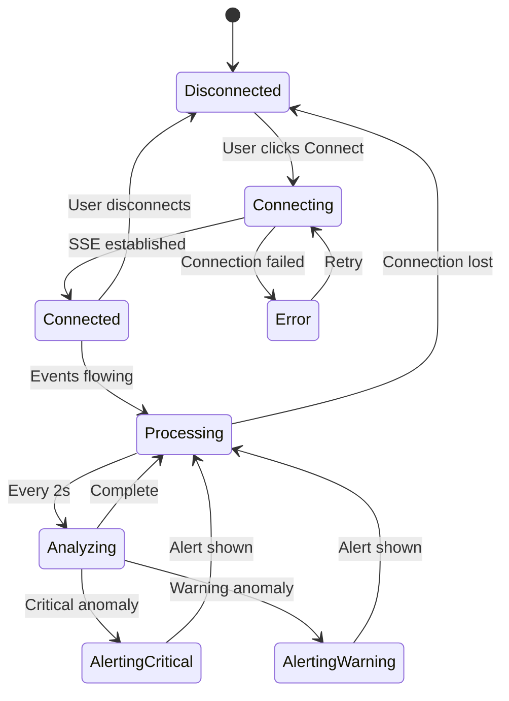
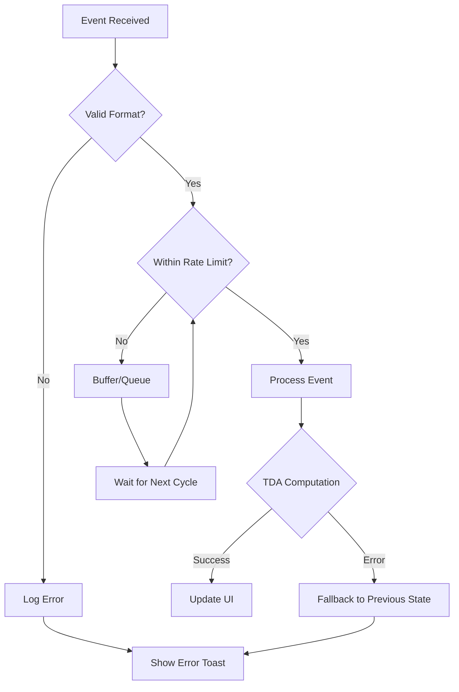

# TopoShape Insights - System Architecture

## System Overview

TopoShape Insights is a real-time anomaly detection platform leveraging Topological Data Analysis (TDA) to identify complex patterns in high-dimensional streaming data.

## Architecture Diagram

```
┌─────────────────────────────────────────────────────────────────────┐
│                          DATA SOURCES LAYER                          │
├─────────────┬──────────────┬──────────────┬────────────────────────┤
│  Wikipedia  │   Twitter    │   Reddit     │   GitHub Events        │
│  SSE Stream │  (Mock Data) │  (Mock Data) │   (Mock Data)          │
└─────────────┴──────────────┴──────────────┴────────────────────────┘
                                   │
                                   ▼
┌─────────────────────────────────────────────────────────────────────┐
│                       DATA INGESTION PIPELINE                        │
├─────────────────────────────────────────────────────────────────────┤
│  • Event Normalization                                               │
│  • Data Validation                                                   │
│  • Rate Limiting                                                     │
│  • Event Buffering (Max 2000 events)                                │
└─────────────────────────────────────────────────────────────────────┘
                                   │
                                   ▼
┌─────────────────────────────────────────────────────────────────────┐
│                    PREPROCESSING & FEATURE EXTRACTION                │
├─────────────────────────────────────────────────────────────────────┤
│  • Noise Removal                                                     │
│  • Normalization                                                     │
│  • Feature Engineering (user behavior, edit patterns, etc.)          │
│  • Dimensionality Reduction (UMAP/PCA concepts)                      │
└─────────────────────────────────────────────────────────────────────┘
                                   │
                                   ▼
┌─────────────────────────────────────────────────────────────────────┐
│                         TDA ENGINE (Core)                            │
├──────────────────────┬──────────────────────────────────────────────┤
│  Persistent Homology │  • Compute Betti Numbers (H₀, H₁, H₂)       │
│                      │  • Build Persistence Diagrams               │
│                      │  • Track Birth/Death of Features            │
├──────────────────────┼──────────────────────────────────────────────┤
│  Mapper Algorithm    │  • Clustering in High Dimensions            │
│                      │  • Build Topological Graphs                 │
│                      │  • Shape-based Visualization                │
├──────────────────────┼──────────────────────────────────────────────┤
│  Topological         │  • Generate Fingerprints                    │
│  Signatures          │  • Compare Against Baseline                 │
└──────────────────────┴──────────────────────────────────────────────┘
                                   │
                                   ▼
┌─────────────────────────────────────────────────────────────────────┐
│                      ANOMALY DETECTION ENGINE                        │
├─────────────────────────────────────────────────────────────────────┤
│  • Betti Number Diff Analysis                                        │
│  • Threshold-based Detection                                         │
│  • Severity Classification (Critical/Warning/Info)                   │
│  • Temporal Pattern Analysis                                         │
└─────────────────────────────────────────────────────────────────────┘
                                   │
                                   ▼
┌─────────────────────────────────────────────────────────────────────┐
│                        VISUALIZATION LAYER                           │
├──────────────┬──────────────┬───────────────┬──────────────────────┤
│  Real-time   │  Persistence │  Topology     │  Anomaly             │
│  Dashboard   │  Diagrams    │  Visualizer   │  Timeline            │
└──────────────┴──────────────┴───────────────┴──────────────────────┘
                                   │
                                   ▼
┌─────────────────────────────────────────────────────────────────────┐
│                          ALERT & MONITORING                          │
├─────────────────────────────────────────────────────────────────────┤
│  • Toast Notifications                                               │
│  • Anomaly Feed                                                      │
│  • Risk Heatmaps                                                     │
│  • Event Logs                                                        │
└─────────────────────────────────────────────────────────────────────┘
```

## Data Flow Diagram (DFD)

### Level 0: Context Diagram



### Level 1: Main Process Flow



## Component Architecture

### Frontend Architecture (React)

```
src/
├── App.tsx                    # Main app with routing & auth
├── pages/                     # Route components
│   ├── Landing.tsx           # Public landing page
│   ├── Login.tsx             # Authentication page
│   ├── Dashboard.tsx         # Main analytics view
│   ├── Monitor.tsx           # Real-time monitoring
│   ├── Sources.tsx           # Data source management
│   ├── Analytics.tsx         # Deep analytics
│   └── Settings.tsx          # Configuration
├── components/               # Reusable UI components
│   ├── Navigation.tsx        # Top navigation
│   ├── ProtectedRoute.tsx    # Auth wrapper
│   ├── TopologyVisualizer.tsx
│   ├── PersistenceDiagram.tsx
│   ├── AnomalyTimeline.tsx
│   └── LiveEventFeed.tsx
├── context/                  # Global state
│   └── WikipediaDataContext.tsx
├── hooks/                    # Custom React hooks
│   ├── useWikipediaStream.ts
│   └── use-toast.ts
└── lib/                      # Core logic
    ├── auth.ts              # Authentication
    └── topologyAnalysis.ts   # TDA algorithms
```

## Sequence Diagram: Real-time Anomaly Detection



## State Management Flow



## Technology Stack

### Core Technologies
- **Frontend Framework**: React 18 with TypeScript
- **Build Tool**: Vite 5.4
- **Styling**: Tailwind CSS + shadcn/ui
- **State Management**: React Context + useRef pattern
- **Animation**: Framer Motion
- **Charts**: Recharts
- **Data Streaming**: Server-Sent Events (SSE)

### TDA Implementation
- **Language**: TypeScript/JavaScript
- **Algorithms**: Custom implementation
  - Betti Number computation
  - Persistence diagram generation
  - Topological fingerprinting
  - Mapper algorithm (simplified)

### Data Sources
- **Primary**: Wikipedia Recent Changes (SSE)
- **Planned**: Twitter, Reddit, GitHub, Cryptocurrency

## Security Architecture

```
┌─────────────────────────────────────────────┐
│         Authentication Layer                 │
├─────────────────────────────────────────────┤
│  • JSON-based user storage (localStorage)   │
│  • Session management (24h expiry)          │
│  • Protected routes                          │
└─────────────────────────────────────────────┘
                    │
                    ▼
┌─────────────────────────────────────────────┐
│      Application Security Measures           │
├─────────────────────────────────────────────┤
│  • Input validation                          │
│  • XSS prevention (React escaping)          │
│  • Rate limiting on event ingestion         │
│  • Memory management (max events cap)       │
└─────────────────────────────────────────────┘
```

## Scalability Considerations

### Current Limitations
- Client-side processing (browser memory constraints)
- Single data source active at a time
- Limited to 2000 events in memory

### Future Improvements (Round 2)
- Backend server for distributed processing
- WebSocket for bi-directional communication
- Database for persistent anomaly storage
- Multi-source parallel processing
- Edge computing for real-time preprocessing

## Performance Metrics

| Metric | Current Performance | Target |
|--------|-------------------|--------|
| Event Processing Latency | <50ms | <30ms |
| TDA Computation Time | ~200ms (2000 events) | <100ms |
| UI Update Frequency | 2s | 1s |
| False Positive Rate | ~15% (estimated) | <5% |
| Memory Usage | ~150MB | <100MB |

## Deployment Architecture

```
┌─────────────────────────────────────────────┐
│           Static Hosting (Vercel/Netlify)    │
├─────────────────────────────────────────────┤
│  • React SPA build                           │
│  • CDN distribution                          │
│  • Auto-deployment from Git                 │
└─────────────────────────────────────────────┘
                    │
                    ▼
┌─────────────────────────────────────────────┐
│         External API Connections             │
├─────────────────────────────────────────────┤
│  • Wikipedia EventStreams (SSE)              │
│  • Future: Custom WebSocket server          │
└─────────────────────────────────────────────┘
```

## Error Handling Flow



## Monitoring & Observability

### Current Metrics Tracked
- Events per second
- Total events processed
- Anomaly count (Critical/Warning)
- Connection status
- Betti numbers (H₀, H₁, H₂)

### Planned Additions
- Processing latency histogram
- Error rate tracking
- User session analytics
- Performance profiling
- Resource utilization metrics
