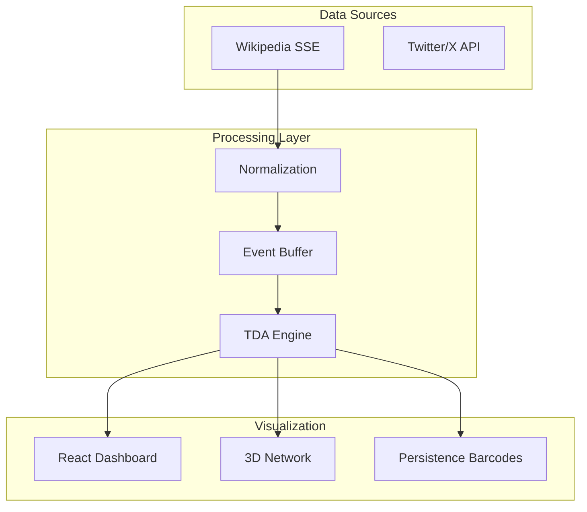

# TopoShape Insights (TopoForge)


> **Real-time Anomaly Detection Platform using Topological Data Analysis (TDA)**

---

## 📋 Table of Contents

- [Overview](#-overview)
- [Key Features](#-key-features)
- [Tech Stack](#-tech-stack)
- [Quick Start](#-quick-start)
- [System Architecture](#-system-architecture)
- [Documentation](#-documentation)
- [Contributing](#-contributing)
- [License](#-license)

---

## 🔭 Overview

**TopoShape Insights** (internally **TopoForge**) is a cutting-edge intelligence platform that leverages **Topological Data Analysis (TDA)** to detect anomalies in high-dimensional streaming data. Unlike traditional statistical methods that rely on thresholds, TopoShape analyzes the **"shape"** and **structure** of data to identify subtle, complex patterns—such as coordinated bot attacks, disinformation campaigns, or system failures.

### Why TDA?
Traditional tools miss "quiet" attacks that have low volume but high structural coordination. By analyzing topological features (Betti numbers, persistence diagrams), TopoShape distinguishes between organic traffic and artificial coordination.

---

## ✨ Key Features

- ✅ **Real-time Anomaly Detection**: Sub-second detection of coordinated attacks.
- ✅ **Topological Analysis**: Computes Betti numbers (H0, H1, H2) on live data streams.
- ✅ **3D Visualization**: Interactive force-directed graphs and persistence barcodes.
- ✅ **Multi-Source Ingestion**: Supports Wikipedia SSE, with planned support for Twitter/X and GitHub.
- ✅ **Performance Optimized**: Client-side heuristic algorithms running at <50ms per window.
- ✅ **Docker Ready**: Containerized for easy deployment.

---

## 🛠 Tech Stack

### Frontend
- **Framework**: React 18, Vite
- **Language**: TypeScript
- **Styling**: Tailwind CSS, Shadcn/UI
- **Visualization**: Three.js (@react-three/fiber), Recharts, D3.js

### Backend
- **API**: Python (FastAPI)
- **Data Processing**: NumPy, Scikit-learn
- **Streaming**: Server-Sent Events (SSE)

---

## 🚀 Quick Start

### Prerequisites
- Node.js v20+
- Python 3.10+
- Docker (optional)

### Installation

1. **Clone the repository**
   ```bash
   git clone https://github.com/Vidish-Bijalwan/WINTER-2026.git
   cd WINTER-2026
   ```

2. **Install Frontend Dependencies**
   ```bash
   npm install
   ```

3. **Install Backend Dependencies**
   ```bash
   cd backend
   python -m venv venv
   source venv/bin/activate  # On Windows: venv\Scripts\activate
   pip install -r requirements.txt
   ```

4. **Start the Application**
   ```bash
   # Terminal 1: Frontend
   npm run dev

   # Terminal 2: Backend
   cd backend
   python main.py
   ```

Visit `http://localhost:5173` to view the dashboard.

---

## 🏗 System Architecture



## 📚 Documentation

- [API Documentation](docs/API.md)
- [Deployment Guide](docs/DEPLOYMENT.md)
- [Screenshots & Demos](docs/SCREENSHOTS.md)

## 🤝 Contributing

We welcome contributions! Please see our [Contributing Guidelines](CONTRIBUTING.md) for details.

## 📄 License

This project is licensed under the MIT License - see the [LICENSE](LICENSE) file for details.

## 🛡 Security

For security concerns, please refer to our [Security Policy](SECURITY.md).
