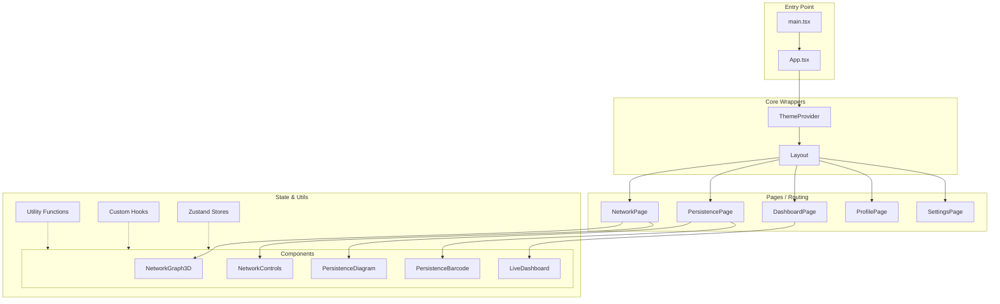

# Project Schema - TopoForge Frontend

This document provides a technical overview of the TopoForge Frontend architecture and component hierarchy.

## Architecture Diagram

## Module Definitions

### 1. Visualizations (`src/components/visualizations`)
- **NetworkGraph3D**: Uses Three.js for 3D topological network rendering.
- **PersistenceDiagram/Barcode**: D3/Recharts based topological data visualization.

### 2. State Management (`src/hooks` & `src/contexts`)
- Uses **Zustand** for lightweight global state management (filtering, data selection).
- **React Context** for theme and low-frequency global settings.

### 3. Layout and Navigation (`src/components/layout`)
- Sidebar-based navigation with responsive collapse.
- Global header with search and user status.

## Data Flow
1. **Fetch/Mock**: Data is retrieved from services or generated in `utils`.
2. **Global Store**: Data is stored in Zustand stores for cross-component access.
3. **Reactive Props**: Components subscribe to store changes to update visualizations in real-time.
