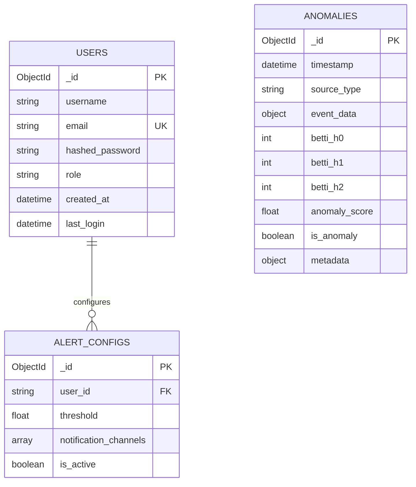
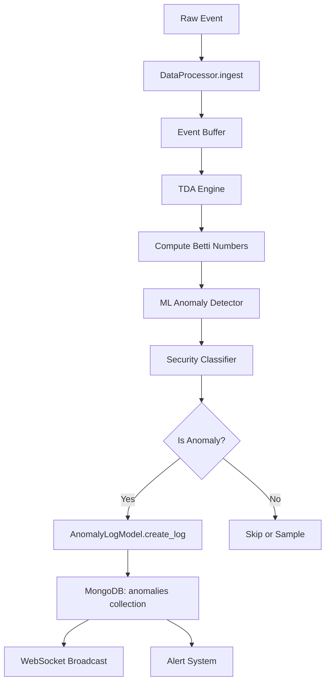

# TopoForge Backend Schema Documentation

Complete documentation of all database schemas, models, and data structures used in the TopoForge Intelligence Engine backend.

---

## Table of Contents

- [Database Collections](#database-collections)
- [Pydantic Schemas](#pydantic-schemas)
- [Database Models](#database-models)
- [API Endpoints Schema](#api-endpoints-schema)
- [Schema Relationships](#schema-relationships)
- [Example Data](#example-data)

---

## Database Collections

The TopoForge backend uses MongoDB with three primary collections:

### 1. `anomalies`

Stores all anomaly detection logs from the TDA processing pipeline.

**Fields:**

| Field           | Type     | Required | Description                                                               |
| --------------- | -------- | -------- | ------------------------------------------------------------------------- |
| `_id`           | ObjectId | Auto     | MongoDB document ID                                                       |
| `timestamp`     | DateTime | Yes      | When the anomaly was detected (UTC)                                       |
| `source_type`   | String   | Yes      | Data source identifier (e.g., "stream_processor", "twitter", "wikipedia") |
| `event_data`    | Object   | Yes      | Raw event data and metadata                                               |
| `betti_h0`      | Integer  | No       | Betti number H₀ (connected components)                                    |
| `betti_h1`      | Integer  | No       | Betti number H₁ (loops/holes)                                             |
| `betti_h2`      | Integer  | No       | Betti number H₂ (voids)                                                   |
| `anomaly_score` | Float    | Yes      | Anomaly severity score (0.0 - 1.0)                                        |
| `is_anomaly`    | Boolean  | Yes      | Whether this event is classified as an anomaly                            |
| `metadata`      | Object   | No       | Additional context (security analysis, etc.)                              |

**Indexes:**

- `timestamp` (ascending) - for time-range queries
- `is_anomaly` (ascending) - for filtering anomalies
- `source_type` (ascending) - for source-specific queries

---

### 2. `users`

Stores user accounts and authentication data.

**Fields:**

| Field             | Type     | Required | Description                             |
| ----------------- | -------- | -------- | --------------------------------------- |
| `_id`             | ObjectId | Auto     | MongoDB document ID                     |
| `username`        | String   | Yes      | Unique username                         |
| `email`           | String   | Yes      | User email address (unique)             |
| `hashed_password` | String   | Yes      | Bcrypt hashed password                  |
| `role`            | String   | Yes      | User role: "viewer", "analyst", "admin" |
| `created_at`      | DateTime | Yes      | Account creation timestamp              |
| `last_login`      | DateTime | No       | Last successful login timestamp         |

**Indexes:**

- `email` (unique, ascending) - for login/lookup
- `username` (unique, ascending) - for display

---

### 3. `alert_configs`

Stores user-specific alert configuration settings.

**Fields:**

| Field                   | Type          | Required | Description                             |
| ----------------------- | ------------- | -------- | --------------------------------------- |
| `_id`                   | ObjectId      | Auto     | MongoDB document ID                     |
| `user_id`               | String        | Yes      | Reference to user's ObjectId            |
| `threshold`             | Float         | Yes      | Anomaly score threshold (0.0 - 1.0)     |
| `notification_channels` | Array[String] | Yes      | Channels: ["email", "slack", "webhook"] |
| `is_active`             | Boolean       | Yes      | Whether this config is active           |

**Indexes:**

- `user_id` (ascending) - for user-specific queries

---

## Pydantic Schemas

Pydantic schemas define request/response validation and serialization.

### AnomalyLogSchema

**Location:** `backend/database/schemas.py`

```python
class AnomalyLogSchema(BaseModel):
    timestamp: datetime = Field(default_factory=datetime.utcnow)
    source_type: str
    event_data: Dict[str, Any]
    betti_h0: Optional[int] = 0
    betti_h1: Optional[int] = 0
    betti_h2: Optional[int] = 0
    anomaly_score: float
    is_anomaly: bool
    metadata: Optional[Dict[str, Any]] = None
```

**Usage:** Request/response for anomaly log creation and retrieval.

**Example:**

```json
{
  "timestamp": "2026-01-12T08:55:00Z",
  "source_type": "twitter",
  "event_data": { "text": "Suspicious tweet content" },
  "betti_h0": 5,
  "betti_h1": 2,
  "betti_h2": 0,
  "anomaly_score": 0.95,
  "is_anomaly": true,
  "metadata": {
    "threat_level": "high",
    "classification": "coordinated_attack"
  }
}
```

---

### UserSchema

**Location:** `backend/database/schemas.py`

```python
class UserSchema(BaseModel):
    username: str
    email: EmailStr
    role: str = "viewer"
    created_at: datetime = Field(default_factory=datetime.utcnow)
    last_login: Optional[datetime] = None
```

**Usage:** Base schema for user data (without password).

---

### UserCreateSchema

**Location:** `backend/database/schemas.py`

```python
class UserCreateSchema(UserSchema):
    password: str
```

**Usage:** Registration endpoint request body.

**Example:**

```json
{
  "username": "analyst_john",
  "email": "john@example.com",
  "password": "SecurePass123!",
  "role": "analyst"
}
```

---

### UserInDB

**Location:** `backend/database/schemas.py`

```python
class UserInDB(UserSchema):
    hashed_password: str
```

**Usage:** Internal representation with hashed password.

---

### AlertConfigSchema

**Location:** `backend/database/schemas.py`

```python
class AlertConfigSchema(BaseModel):
    user_id: str
    threshold: float
    notification_channels: List[str]
    is_active: bool = True
```

**Usage:** Alert configuration management.

**Example:**

```json
{
  "user_id": "507f1f77bcf86cd799439011",
  "threshold": 0.75,
  "notification_channels": ["email", "slack"],
  "is_active": true
}
```

---

## Database Models

Database models provide async methods for CRUD operations.

### AnomalyLogModel

**Location:** `backend/database/models.py`

**Collection:** `anomalies`

**Methods:**

| Method                              | Parameters                       | Returns      | Description                        |
| ----------------------------------- | -------------------------------- | ------------ | ---------------------------------- |
| `create_log(data)`                  | `data: Dict[str, Any]`           | `str` (ID)   | Insert new anomaly log             |
| `get_logs_by_timeframe(start, end)` | `start: datetime, end: datetime` | `List[Dict]` | Query logs by date range           |
| `get_anomalies_only()`              | None                             | `List[Dict]` | Get only anomalous events          |
| `export_to_csv()`                   | None                             | `List[Dict]` | Export all logs for CSV generation |

**Example Usage:**

```python
anomaly_model = AnomalyLogModel()
log_id = await anomaly_model.create_log({
    "timestamp": datetime.utcnow(),
    "source_type": "wikipedia",
    "event_data": {"page": "Example"},
    "anomaly_score": 0.88,
    "is_anomaly": True
})
```

---

### UserModel

**Location:** `backend/database/models.py`

**Collection:** `users`

**Methods:**

| Method                          | Parameters                  | Returns          | Description             |
| ------------------------------- | --------------------------- | ---------------- | ----------------------- |
| `create_user(user_data)`        | `user_data: Dict[str, Any]` | `str` (ID)       | Create new user account |
| `get_user_by_email(email)`      | `email: str`                | `Dict` or `None` | Find user by email      |
| `get_user_by_id(user_id)`       | `user_id: str`              | `Dict` or `None` | Find user by ID         |
| `update_profile(user_id, data)` | `user_id: str, data: Dict`  | `int` (count)    | Update user profile     |

**Example Usage:**

```python
user_model = UserModel()
user = await user_model.get_user_by_email("john@example.com")
```

---

### AlertConfigModel

**Location:** `backend/database/models.py`

**Collection:** `alert_configs`

**Methods:**

| Method                           | Parameters                    | Returns       | Description                |
| -------------------------------- | ----------------------------- | ------------- | -------------------------- |
| `create_config(config_data)`     | `config_data: Dict[str, Any]` | `str` (ID)    | Create alert configuration |
| `get_user_configs(user_id)`      | `user_id: str`                | `List[Dict]`  | Get all configs for a user |
| `update_config(config_id, data)` | `config_id: str, data: Dict`  | `int` (count) | Update configuration       |

---

## API Endpoints Schema

### Authentication Endpoints

**Base Path:** `/api/auth`

#### POST `/api/auth/register`

**Request Body:** `UserCreateSchema`

**Response:** `UserSchema` (201 Created)

**Errors:**

- 400: Email already registered

---

#### POST `/api/auth/login`

**Request Body:** OAuth2 form (`username`, `password`)

**Response:**

```json
{
  "access_token": "eyJhbGc...",
  "token_type": "bearer"
}
```

**Errors:**

- 401: Invalid credentials

---

#### GET `/api/auth/me`

**Headers:** `Authorization: Bearer <token>`

**Response:** Current user profile

---

### Anomaly Endpoints

**Base Path:** `/api/anomalies`

#### POST `/api/anomalies/`

**Request Body:** `AnomalyLogSchema`

**Response:** Created anomaly with ID

---

#### GET `/api/anomalies/`

**Query Parameters:**

- `start_date` (optional): ISO datetime
- `end_date` (optional): ISO datetime
- `source` (optional): Source type filter
- `page` (default: 1): Page number
- `limit` (default: 20): Items per page

**Response:**

```json
{
  "data": [...],
  "page": 1,
  "limit": 20
}
```

---

#### GET `/api/anomalies/stats`

**Response:**

```json
{
  "total_anomalies": 142,
  "by_source": {
    "twitter": 85,
    "wikipedia": 57
  },
  "severity_distribution": {
    "critical": 12,
    "warning": 45,
    "info": 85
  }
}
```

---

#### GET `/api/anomalies/export`

**Response:** Export data with count

---

### User Management Endpoints

**Base Path:** `/api/users`

#### GET `/api/users/`

**Response:** `List[UserSchema]`

---

#### GET `/api/users/{id}`

**Response:** `UserSchema`

**Errors:**

- 404: User not found

---

#### PUT `/api/users/{id}`

**Request Body:** `UserSchema`

**Response:** Success message

---

#### DELETE `/api/users/{id}`

**Response:** Deletion confirmation

---

## Schema Relationships



---

## Example Data

### Complete Anomaly Document

```json
{
  "_id": "507f1f77bcf86cd799439011",
  "timestamp": "2026-01-12T08:55:23.123Z",
  "source_type": "stream_processor",
  "event_data": {
    "recent_values": [
      [0.5, 0.1],
      [0.7, 0.2],
      [0.9, 0.3]
    ]
  },
  "betti_h0": 3,
  "betti_h1": 1,
  "betti_h2": 0,
  "anomaly_score": 0.87,
  "is_anomaly": true,
  "metadata": {
    "threat_level": "warning",
    "classification": "structural_anomaly",
    "window_size": 50
  }
}
```

---

### Complete User Document

```json
{
  "_id": "507f191e810c19729de860ea",
  "username": "security_analyst",
  "email": "analyst@topoforge.com",
  "hashed_password": "$2b$12$KIXxLV...",
  "role": "analyst",
  "created_at": "2026-01-01T00:00:00.000Z",
  "last_login": "2026-01-12T08:30:00.000Z"
}
```

---

### Complete Alert Config Document

```json
{
  "_id": "507f191e810c19729de860eb",
  "user_id": "507f191e810c19729de860ea",
  "threshold": 0.8,
  "notification_channels": ["email", "slack", "webhook"],
  "is_active": true
}
```

---

## Data Processing Flow



---

## Schema Validation Rules

### Field Constraints

**Anomaly Score:**

- Range: 0.0 - 1.0
- Higher = more anomalous

**User Roles:**

- Allowed values: `viewer`, `analyst`, `admin`
- Default: `viewer`

**Alert Threshold:**

- Range: 0.0 - 1.0
- Determines when to trigger notifications

**Notification Channels:**

- Allowed values: `email`, `slack`, `webhook`
- Must be non-empty array

---

## Notes

- All timestamps are stored in UTC
- ObjectIds are converted to strings in API responses
- Passwords are hashed using bcrypt with 12 rounds
- JWT tokens contain: user_id, username, role
- The TDA engine computes Betti numbers in real-time
- Anomalies are automatically logged when `is_anomaly = true`
