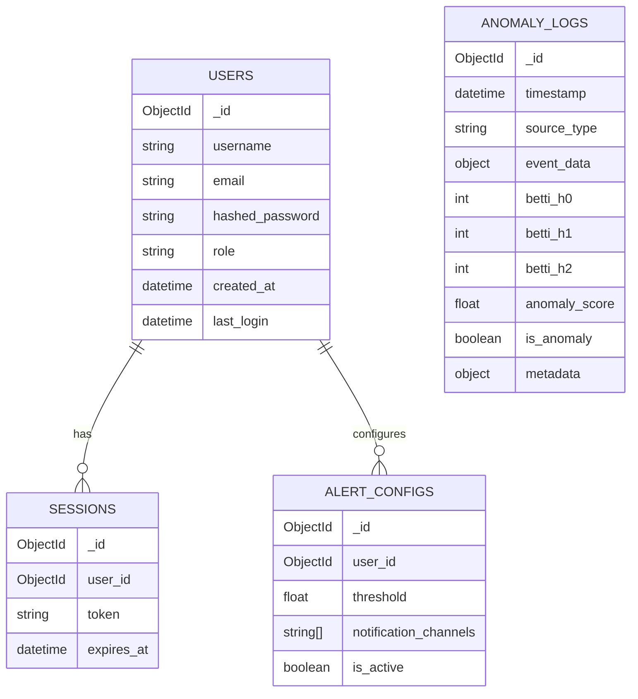

# TopoForge Database Schema Documentation

This document describes the MongoDB database structure for the TopoForge anomaly detection platform.

## ER Diagram

## Collections

### 1. Users (`users`)

Stores user account information for authentication and authorization.

| Field             | Type     | Required | Description                    |
| ----------------- | -------- | -------- | ------------------------------ |
| `_id`             | ObjectId | Yes      | Unique identifier              |
| `username`        | String   | Yes      | Display name                   |
| `email`           | String   | Yes      | Unique email address (Indexed) |
| `hashed_password` | String   | Yes      | Bcrypt hash of password        |
| `role`            | String   | Yes      | 'admin' or 'viewer'            |
| `created_at`      | DateTime | Yes      | Account creation timestamp     |
| `last_login`      | DateTime | No       | Last successful login          |

### 2. Anomaly Logs (`anomalies`)

Stores detected anomalies and their topological features.

| Field           | Type     | Required | Description                               |
| --------------- | -------- | -------- | ----------------------------------------- |
| `_id`           | ObjectId | Yes      | Unique identifier                         |
| `timestamp`     | DateTime | Yes      | Detection time (Compound Index)           |
| `source_type`   | String   | Yes      | Source of data (e.g., 'twitter')          |
| `event_data`    | Object   | Yes      | Raw event data snapshot                   |
| `betti_h0`      | Int      | No       | 0th Betti number (Components)             |
| `betti_h1`      | Int      | No       | 1st Betti number (Loops)                  |
| `betti_h2`      | Int      | No       | 2nd Betti number (Voids)                  |
| `anomaly_score` | Float    | Yes      | Calculated severity (0.0-1.0)             |
| `is_anomaly`    | Boolean  | Yes      | Flag if anomaly                           |
| `metadata`      | Object   | No       | Additional context (e.g., security class) |

### 3. Sessions (`sessions`)

Manages active user sessions.

| Field        | Type     | Required | Description                          |
| ------------ | -------- | -------- | ------------------------------------ |
| `_id`        | ObjectId | Yes      | Unique identifier                    |
| `user_id`    | ObjectId | Yes      | Reference to User                    |
| `token`      | String   | Yes      | Refresh token                        |
| `expires_at` | DateTime | Yes      | Expiry time (TTL Index: auto-delete) |

### 4. Alert Configs (`alert_configs`)

User preferences for anomaly notifications.

| Field                   | Type     | Required | Description                        |
| ----------------------- | -------- | -------- | ---------------------------------- |
| `_id`                   | ObjectId | Yes      | Unique identifier                  |
| `user_id`               | ObjectId | Yes      | Reference to User                  |
| `threshold`             | Float    | Yes      | Minimum score to trigger alert     |
| `notification_channels` | Array    | Yes      | List of channels (e.g., ['email']) |
| `is_active`             | Boolean  | Yes      | Config status                      |

## Indexes

- **Users**: `{ "email": 1 }` (Unique)
- **Anomalies**: `{ "timestamp": -1, "source_type": 1 }` (Query optimization)
- **Sessions**: `{ "expires_at": 1 }` (TTL: expireAfterSeconds=0)
- **AlertConfigs**: `{ "user_id": 1 }`

## Data Retention Policy

- **Anomaly Logs**: Retained for 90 days.
- **Sessions**: Retained for 7 days (managed by TTL index).
- **Users**: Indefinite storage until account deletion.

## Backup Strategy

- **Daily**: Automated snapshots via MongoDB Atlas.
- **On-Demand**: Export API to CSV/JSON.
