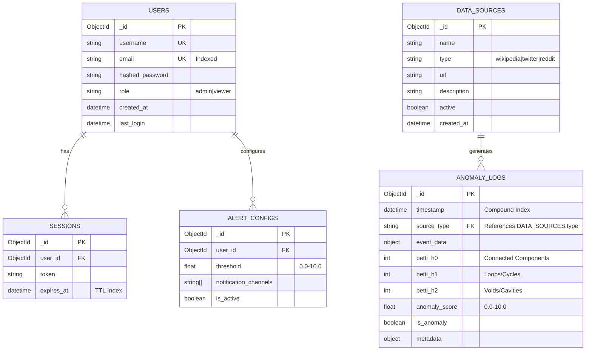
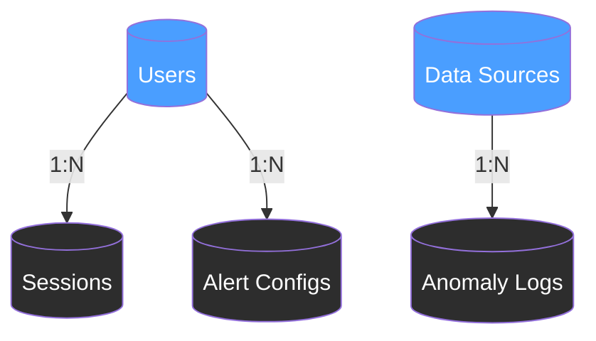
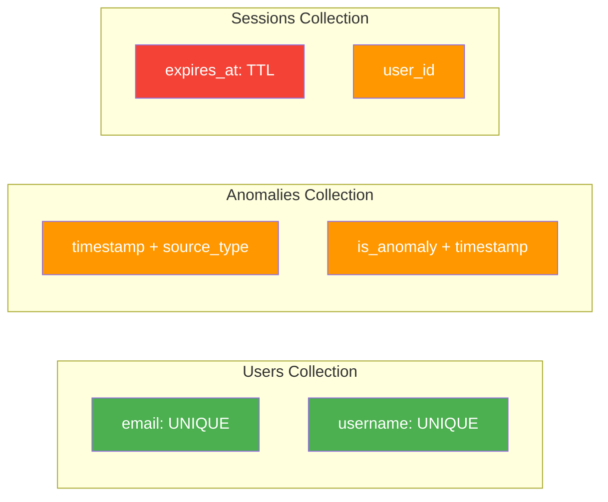

# TopoForge Database Schema Documentation

This document describes the MongoDB database structure for the TopoForge anomaly detection platform.

## ER Diagram



## Collections

### 1. Users (`users`)

Stores user account information for authentication and authorization.

| Field             | Type     | Required | Description                    |
| ----------------- | -------- | -------- | ------------------------------ |
| `_id`             | ObjectId | Yes      | Unique identifier              |
| `username`        | String   | Yes      | Display name                   |
| `email`           | String   | Yes      | Unique email address (Indexed) |
| `hashed_password` | String   | Yes      | Bcrypt hash of password        |
| `role`            | String   | Yes      | 'admin' or 'viewer'            |
| `created_at`      | DateTime | Yes      | Account creation timestamp     |
| `last_login`      | DateTime | No       | Last successful login          |

### 2. Anomaly Logs (`anomalies`)

Stores detected anomalies and their topological features.

| Field           | Type     | Required | Description                               |
| --------------- | -------- | -------- | ----------------------------------------- |
| `_id`           | ObjectId | Yes      | Unique identifier                         |
| `timestamp`     | DateTime | Yes      | Detection time (Compound Index)           |
| `source_type`   | String   | Yes      | Source of data (e.g., 'wikipedia')        |
| `event_data`    | Object   | Yes      | Raw event data snapshot                   |
| `betti_h0`      | Int      | No       | 0th Betti number (Components)             |
| `betti_h1`      | Int      | No       | 1st Betti number (Loops)                  |
| `betti_h2`      | Int      | No       | 2nd Betti number (Voids)                  |
| `anomaly_score` | Float    | Yes      | Calculated severity (0.0-10.0)            |
| `is_anomaly`    | Boolean  | Yes      | Flag if anomaly (threshold: score > 3.0)  |
| `metadata`      | Object   | No       | Additional context (e.g., security class) |

### 3. Sessions (`sessions`)

Manages active user sessions.

| Field        | Type     | Required | Description                          |
| ------------ | -------- | -------- | ------------------------------------ |
| `_id`        | ObjectId | Yes      | Unique identifier                    |
| `user_id`    | ObjectId | Yes      | Reference to User                    |
| `token`      | String   | Yes      | Refresh token                        |
| `expires_at` | DateTime | Yes      | Expiry time (TTL Index: auto-delete) |

### 4. Alert Configs (`alert_configs`)

User preferences for anomaly notifications.

| Field                   | Type     | Required | Description                        |
| ----------------------- | -------- | -------- | ---------------------------------- |
| `_id`                   | ObjectId | Yes      | Unique identifier                  |
| `user_id`               | ObjectId | Yes      | Reference to User                  |
| `threshold`             | Float    | Yes      | Minimum score to trigger alert     |
| `notification_channels` | Array    | Yes      | List of channels (e.g., ['email']) |
| `is_active`             | Boolean  | Yes      | Config status                      |

### 5. Data Sources (`data_sources`)

Available data sources for anomaly detection.

| Field         | Type     | Required | Description                           |
| ------------- | -------- | -------- | ------------------------------------- |
| `_id`         | ObjectId | Yes      | Unique identifier                     |
| `name`        | String   | Yes      | Display name                          |
| `type`        | String   | Yes      | Source type (wikipedia, twitter, etc) |
| `url`         | String   | Yes      | API endpoint or stream URL            |
| `description` | String   | No       | Source description                    |
| `active`      | Boolean  | Yes      | Whether source is active              |
| `created_at`  | DateTime | Yes      | Creation timestamp                    |

## Collection Relationships



**Relationship Details:**
- One User can have multiple Sessions (1:N)
- One User can have multiple Alert Configs (1:N)
- One Data Source can generate multiple Anomaly Logs (1:N)
- Anomaly Logs reference Data Sources via `source_type` field

---

## Indexes

### Primary Indexes
- **Users**: 
  - `{ "email": 1 }` - Unique index for login lookups
  - `{ "username": 1 }` - Unique index for user identification
  
- **Anomalies**: 
  - `{ "timestamp": -1, "source_type": 1 }` - Compound index for time-based queries
  - `{ "is_anomaly": 1, "timestamp": -1 }` - Index for anomaly filtering
  
- **Sessions**: 
  - `{ "expires_at": 1 }` - TTL index (expireAfterSeconds=0) for auto-deletion
  - `{ "user_id": 1 }` - Index for user session queries
  
- **AlertConfigs**: 
  - `{ "user_id": 1, "is_active": 1 }` - Compound index for active configs
  
- **DataSources**:
  - `{ "type": 1, "active": 1 }` - Compound index for source filtering

### Index Visualization



---

## Example Documents

### User Document
```json
{
  "_id": ObjectId("507f1f77bcf86cd799439011"),
  "username": "analyst_john",
  "email": "john@toposhape.io",
  "hashed_password": "$2b$12$K1zTHIZ...",
  "role": "admin",
  "full_name": "John Doe",
  "organization": "TopoShape Research",
  "created_at": ISODate("2024-01-15T10:30:00Z"),
  "last_login": ISODate("2026-01-12T08:14:35Z")
}
```

### Anomaly Log Document
```json
{
  "_id": ObjectId("65a1b2c3d4e5f6789abcdef0"),
  "timestamp": ISODate("2026-01-12T13:42:15Z"),
  "source_type": "wikipedia",
  "event_data": {
    "user": "SuspiciousBot123",
    "page": "Important_Article",
    "edit_delta": 5000,
    "comment": "automated edit"
  },
  "betti_h0": 245,
  "betti_h1": 18,
  "betti_h2": 3,
  "anomaly_score": 7.8,
  "is_anomaly": true,
  "metadata": {
    "wasserstein_distance": 4.2,
    "landscape_norm": 3.1,
    "statistical_component": 2.5,
    "confidence": 0.92
  }
}
```

### Data Source Document
```json
{
  "_id": ObjectId("65a1b2c3d4e5f6789abcdef1"),
  "name": "Wikipedia Recent Changes",
  "type": "wikipedia",
  "url": "https://stream.wikimedia.org/v2/stream/recentchange",
  "description": "Real-time stream of all edits across all Wikimedia projects",
  "active": true,
  "created_at": ISODate("2024-01-10T00:00:00Z")
}
```

### Session Document
```json
{
  "_id": ObjectId("65a1b2c3d4e5f6789abcdef2"),
  "user_id": ObjectId("507f1f77bcf86cd799439011"),
  "token": "eyJhbGciOiJIUzI1NiIsInR5cCI6IkpXVCJ9...",
  "expires_at": ISODate("2026-01-19T13:42:00Z")
}
```

## Data Retention Policy

- **Anomaly Logs**: Retained for 90 days.
- **Sessions**: Retained for 7 days (managed by TTL index).
- **Users**: Indefinite storage until account deletion.

## Backup Strategy

- **Daily**: Automated snapshots via MongoDB Atlas.
- **On-Demand**: Export API to CSV/JSON.
