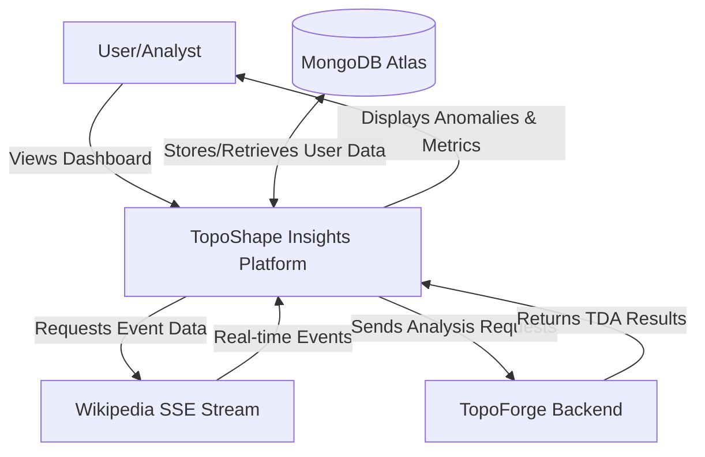
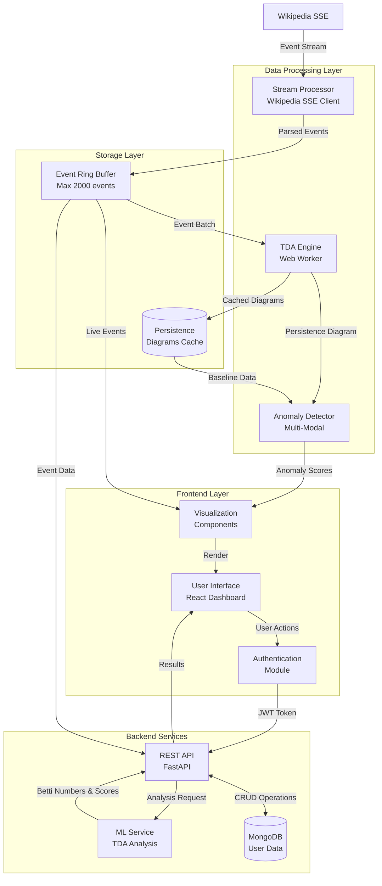
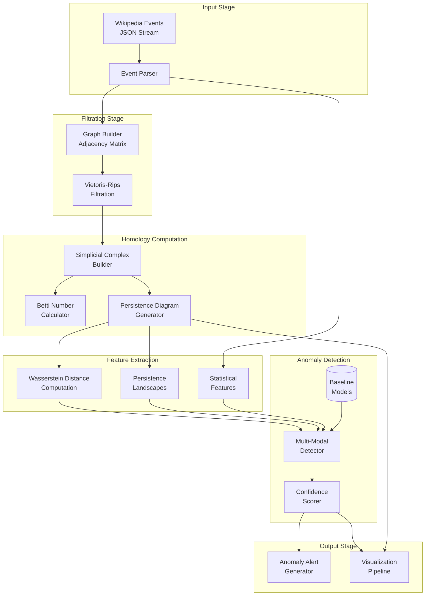
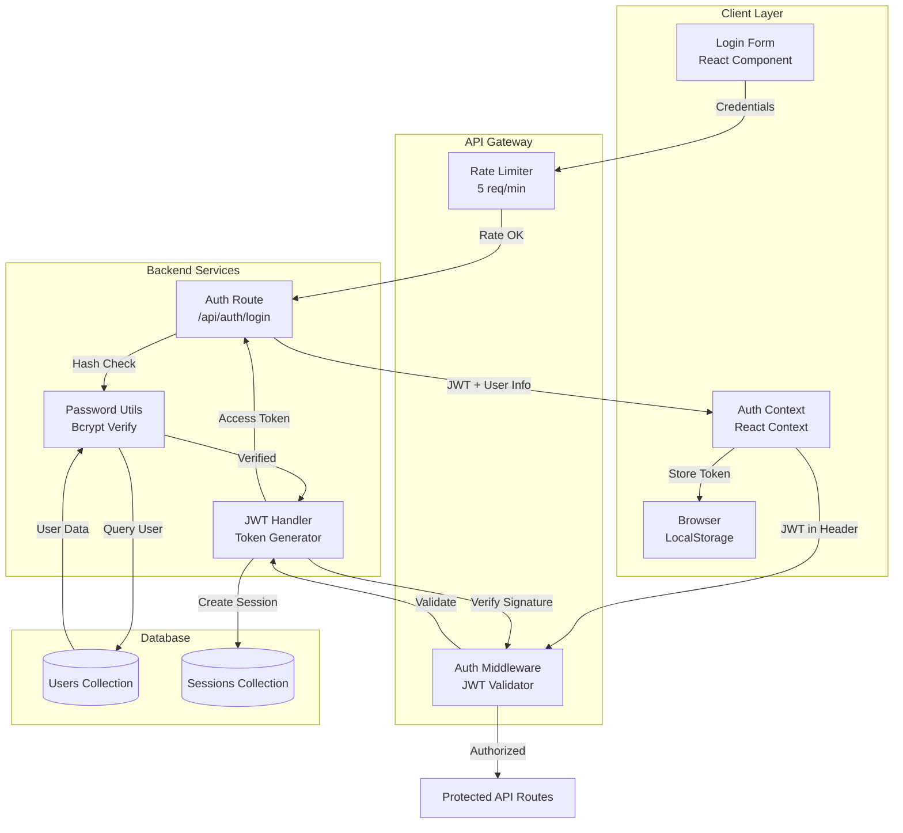
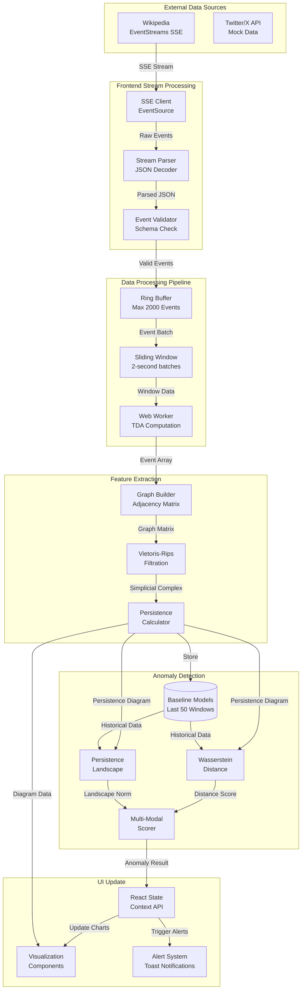
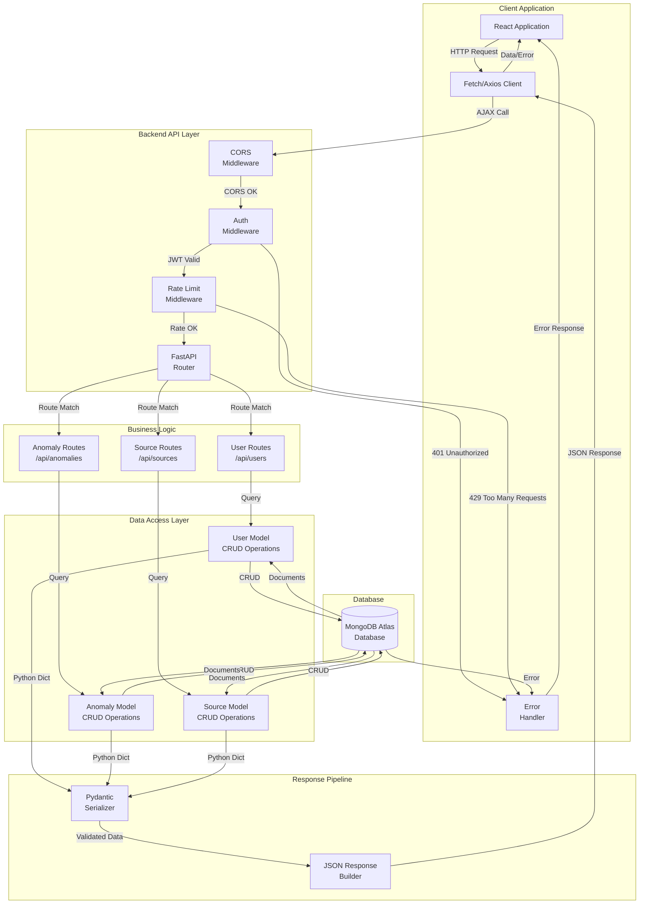
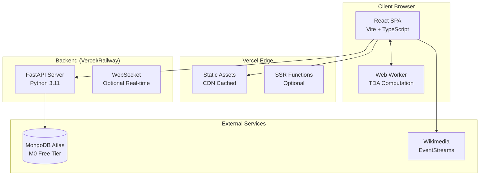

# TopoShape Insights - Data Flow Diagrams (DFDs)

## System Overview
TopoShape Insights is a real-time anomaly detection platform using Topological Data Analysis (TDA).

---

## Level 0 DFD - Context Diagram

**External Entities:**
- **User/Analyst**: Accesses dashboard, views anomaly alerts
- **Wikipedia SSE**: Provides real-time edit stream
- **MongoDB Atlas**: Persistent storage for authentication & settings
- **TopoForge Backend**: AI-powered TDA processing service

---

## Level 1 DFD - High-Level Data Flow

**Processes:**
1. **Stream Processor**: Connects to Wikipedia SSE, parses events
2. **TDA Engine**: Computes persistence diagrams in Web Worker
3. **Anomaly Detector**: Multi-modal scoring (Wasserstein + Landscapes + Stats)
4. **Visualization**: Renders charts (Barcode, Birth-Death, Filtration)
5. **API Layer**: Authentication, user management, ML integration

---

## Level 2 DFD - TDA Processing Pipeline

**Key Data Stores:**
- **Event Ring Buffer**: FIFO queue, max 2000 events
- **Baseline Models**: Last 50 persistence diagrams for normal traffic
- **Persistence Cache**: Temporary storage for diagram history

**Data Transformations:**
1. Raw JSON → Structured WikipediaEvent
2. Events → Graph (user-page-edit network)
3. Graph → Simplicial Complex (filtration)
4. Complex → Persistence Diagram (birth-death pairs)
5. Diagram → Feature Vector (Wasserstein, Landscapes)
6. Features → Anomaly Score (0-10 scale)

---

## Data Dictionary

| Data Element | Type | Source | Destination | Description |
|-------------|------|--------|-------------|-------------|
| WikipediaEvent | Object | SSE Stream | Event Buffer | Raw edit event with metadata |
| PersistenceDiagram | Array<Point> | TDA Engine | Detector | Set of (birth, death, dimension) tuples |
| AnomalyScore | Object | Detector | UI | {totalScore, confidence, components, isAnomaly} |
| BettiNumbers | Object | Homology | Backend | {h0, h1, h2} - connected components, loops, voids |
| WassersteinDistance | Number | Feature Extractor | Detector | L1-metric between diagrams |
| LandscapeNorm | Number | Feature Extractor | Detector | L2-norm of persistence landscape |

---

## Level 2 DFD - Authentication Flow

**Authentication Process Details:**
1. **Login Request**: User submits credentials via React form
2. **Rate Limiting**: Middleware checks request rate (5 attempts/min)
3. **Password Verification**: Bcrypt compares hashed passwords
4. **JWT Generation**: Creates access token (24h expiry) and refresh token (7d expiry)
5. **Session Storage**: Stores session in MongoDB with TTL index
6. **Token Storage**: Client stores JWT in localStorage
7. **Authorization**: Middleware validates JWT on protected routes

---

## Level 2 DFD - Real-time Data Streaming Flow

**Real-time Processing Metrics:**
- **Stream Rate**: 5-10 events/second (Wikipedia)
- **Buffer Capacity**: 2000 events (FIFO)
- **Processing Window**: 2 seconds (1000ms batches)
- **TDA Computation**: ~200ms for 2000 events
- **Anomaly Detection**: ~50ms per window
- **UI Update Frequency**: 2 seconds

---

## Level 2 DFD - API Request/Response Flow

**API Endpoints:**

| Method | Endpoint | Description | Auth Required |
|--------|----------|-------------|---------------|
| POST | `/api/auth/login` | User login | No |
| POST | `/api/auth/register` | User registration | No |
| GET | `/api/users/me` | Get current user | Yes |
| GET | `/api/anomalies` | List all anomalies | Yes |
| POST | `/api/anomalies` | Create anomaly log | Yes |
| GET | `/api/sources` | List data sources | Yes |
| POST | `/api/sources` | Add data source | Yes |
| DELETE | `/api/sources/{id}` | Remove data source | Yes |

---

## Process Specifications

### Process 1: Compute Persistence Diagram
**Input**: WikipediaEvent[], windowMs: number
**Output**: PersistencePoint[]
**Logic**:
1. Filter events within time window
2. Build user-page bipartite graph
3. Compute edge weights (edit frequency, delta)
4. Apply Vietoris-Rips filtration
5. Extract homology features (H0, H1, H2)
6. Return persistence pairs

### Process 2: Detect Anomalies (Multi-Modal)
**Input**: PersistenceDiagram, editRate: number
**Output**: AnomalyScore
**Logic**:
1. Compute Wasserstein distance to baseline
2. Calculate landscape norm deviation (z-score)
3. Compute statistical component (edit rate spike)
4. Weighted combination: `score = 0.4*W + 0.4*L + 0.2*S`
5. Confidence based on baseline size
6. Threshold: `isAnomaly = score > 3.0`

---

## Deployment Architecture

**Technology Stack:**
- **Frontend**: React 18, TypeScript, TailwindCSS, Recharts, Three.js
- **Backend**: FastAPI, Python 3.11, Pydantic, Motor (async MongoDB)
- **Database**: MongoDB Atlas
- **Deployment**: Vercel (Frontend), Railway/Vercel (Backend)
- **CI/CD**: GitHub Actions

---

## Security & Performance Considerations

**Security:**
- JWT-based authentication
- HTTPS/TLS for all connections
- Environment variable management
- CORS configuration
- Rate limiting on API endpoints

**Performance:**
- Web Workers for CPU-intensive TDA
- Event ring buffer (O(1) insertions)
- Incremental persistence updates
- Lazy loading for visualizations
- Production build optimization (tree-shaking, code splitting)

---

**Document Version**: 1.0
**Last Updated**: 2026-01-11
**Author**: TopoShape Insights Team
