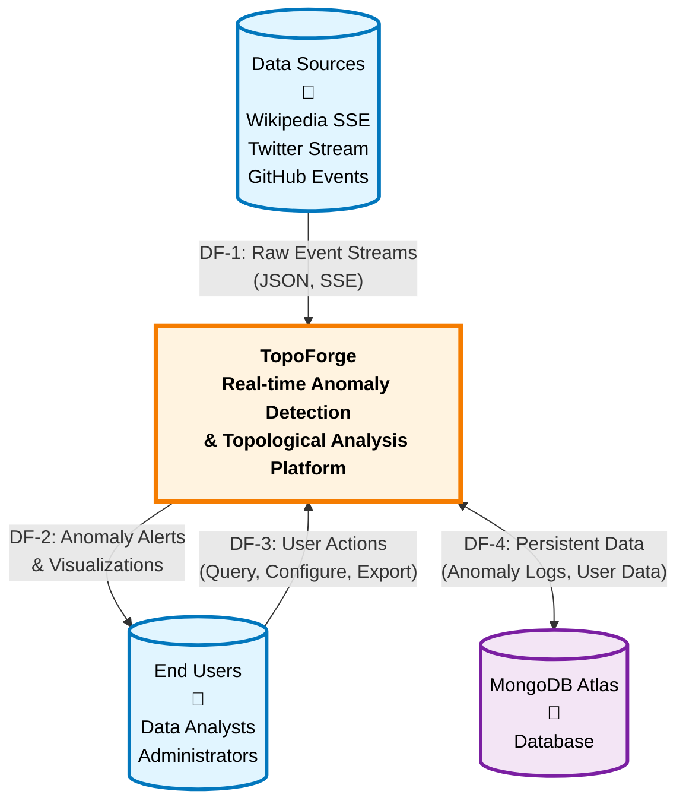

# Data Flow Diagram - Level 0 (Context Diagram)

**Document Version:** 1.0  
**Date:** January 10, 2026  
**Author:** Team Member 3 - Testing & Documentation

---

## Overview

This Level 0 Data Flow Diagram (Context Diagram) provides a high-level view of the TopoForge Anomaly Detection System and its interactions with external entities. It shows the system as a single process and illustrates the major data flows between the system and its environment.

---

## Context Diagram

---

## External Entities

### 1. Data Sources 📡

**Description:** External real-time data streams providing event data for analysis

**Components:**
- **Wikipedia SSE:** Server-Sent Events stream from Wikimedia EventStreams
- **Twitter Stream:** Real-time tweet data via Twitter API (if available)
- **GitHub Events:** Repository activity from GitHub Events API

**Data Format:** JSON objects containing event metadata, timestamps, and activity metrics

---

### 2. End Users 👤

**Description:** Human users who interact with the TopoForge platform

**User Roles:**
- **Data Analysts:** View anomaly visualizations, analyze patterns, query historical data
- **Administrators:** Configure system settings, manage users, set alert thresholds

**Access Methods:** 
- Web browser interface (React dashboard)
- API endpoints for programmatic access

---

### 3. MongoDB Atlas 💾

**Description:** Cloud-hosted MongoDB database for persistent data storage

**Stored Data:**
- Anomaly detection logs
- User accounts and authentication data
- Session tokens
- Alert configurations
- System metrics

---

## Data Flows

### DF-1: Raw Event Streams (Data Sources → TopoForge)

| Attribute | Details |
|-----------|---------|
| **Flow ID** | DF-1 |
| **Source** | Data Sources (Wikipedia, Twitter, GitHub) |
| **Destination** | TopoForge System |
| **Data Type** | JSON event objects |
| **Protocol** | Server-Sent Events (SSE), REST API |
| **Frequency** | Real-time continuous stream |
| **Volume** | ~100-1000 events/second |

**Data Contents:**
- Event timestamp
- Event source identifier
- Event-specific metadata (page edits, tweets, commits)
- User/actor information
- Activity metrics

---

### DF-2: Anomaly Alerts & Visualizations (TopoForge → End Users)

| Attribute | Details |
|-----------|---------|
| **Flow ID** | DF-2 |
| **Source** | TopoForge System |
| **Destination** | End Users |
| **Data Type** | HTML/JSON responses, WebSocket messages |
| **Protocol** | HTTPS, WebSocket |
| **Frequency** | On-demand and real-time push |
| **Format** | Dashboard visualizations, alert notifications |

**Data Contents:**
- Detected anomalies with scores
- 3D network topology visualizations
- Persistence diagrams
- Betti numbers (H0, H1, H2)
- Historical trends and statistics
- Alert notifications

---

### DF-3: User Actions (End Users → TopoForge)

| Attribute | Details |
|-----------|---------|
| **Flow ID** | DF-3 |
| **Source** | End Users |
| **Destination** | TopoForge System |
| **Data Type** | HTTP requests, form data, API calls |
| **Protocol** | HTTPS |
| **Frequency** | On-demand user-initiated |

**Data Contents:**
- Authentication credentials (login, register)
- Query parameters (filters, date ranges)
- Configuration changes (alert thresholds)
- Export requests (CSV, JSON)
- User preferences and settings

---

### DF-4: Persistent Data (TopoForge ↔ MongoDB Atlas)

| Attribute | Details |
|-----------|---------|
| **Flow ID** | DF-4 |
| **Source/Destination** | Bidirectional: TopoForge ↔ MongoDB |
| **Data Type** | BSON documents |
| **Protocol** | MongoDB Wire Protocol |
| **Frequency** | Continuous read/write operations |

**Data Contents (Write):**
- New anomaly detection results
- User registration/profile updates
- Session tokens
- Alert configurations
- System logs

**Data Contents (Read):**
- Historical anomaly data for queries
- User authentication data
- Stored configurations
- Dashboard statistics

---

## Legend

### Symbols Used

| Symbol | Meaning | Usage |
|--------|---------|-------|
| Rectangle | External Entity | Data sources, users that interact with the system |
| Rectangle (bold) | System Process | The TopoForge system as a single unit |
| Cylinder | Data Store | MongoDB database |
| Arrow | Data Flow | Direction of data movement |

---

## System Boundaries

### In Scope
- Real-time event ingestion and processing
- Topological data analysis (TDA) computations
- Anomaly detection algorithms
- User authentication and authorization
- Data visualization and reporting
- Alert notifications

### Out of Scope
- Management of external data sources (Wikipedia, Twitter, GitHub)
- MongoDB Atlas infrastructure management
- User device/browser functionality
- Network infrastructure between components

---

## Assumptions and Constraints

### Assumptions
1. External data sources provide reliable, continuous streams
2. MongoDB Atlas is available with low latency
3. Users have modern web browsers with JavaScript enabled
4. Network connectivity is stable for real-time updates

### Constraints
1. API rate limits from external data providers
2. Database storage limits (90-day retention)
3. Computational limits for TDA algorithms on large datasets
4. Browser performance for 3D visualizations

---

## Revision History

| Version | Date | Author | Changes |
|---------|------|--------|---------|
| 1.0 | 2026-01-10 | Team Member 3 | Initial DFD Level 0 creation |

---

## References

- [DFD Level 1 - System Overview](file:///d:/os%20lab/WINTER-2026/docs/architecture/DFD_LEVEL_1.md)
- [DFD Level 2 - Detailed Processes](file:///d:/os%20lab/WINTER-2026/docs/architecture/DFD_LEVEL_2.md)
- [Architecture Documentation](file:///d:/os%20lab/WINTER-2026/ARCHITECTURE.md)
- [Database Schema](file:///d:/os%20lab/WINTER-2026/docs/database/DATABASE_SCHEMA.md)
