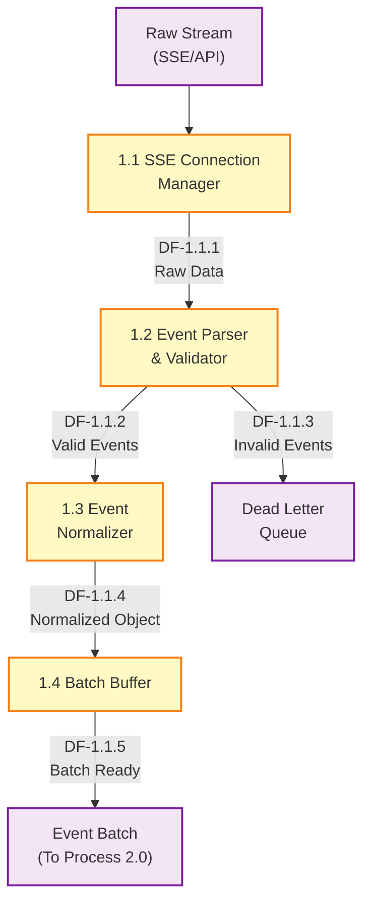
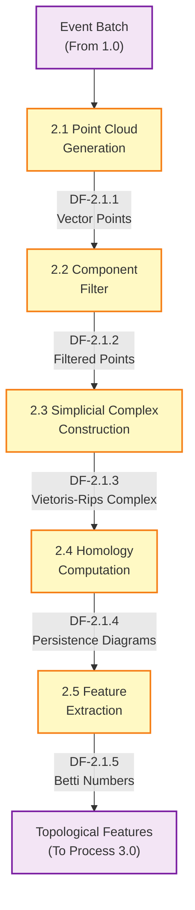
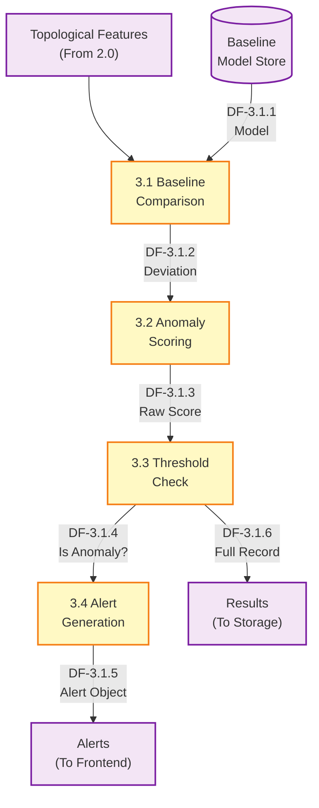
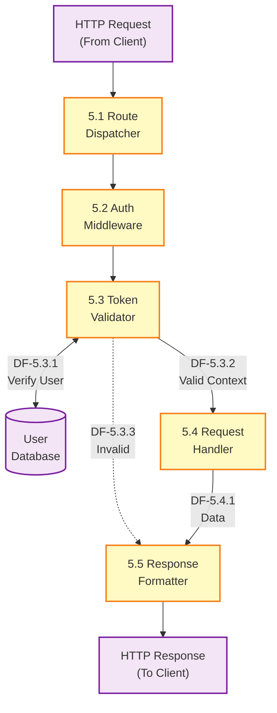

# Data Flow Diagram - Level 2 (Detailed Processes)

**Document Version:** 1.0  
**Date:** January 10, 2026  
**Author:** Team Member 3 - Testing & Documentation

---

## Overview

This Level 2 Data Flow Diagram breaks down the major subsystems identified in Level 1 into detailed processes. It focuses on the internal logic of critical components, specifically Data Ingestion, TDA Processing, Anomaly Detection, and the API Layer.

---

## 1.0 Data Ingestion Process Detail



### Process Descriptions (1.0)

| Process ID | Name | Description | Input | Output |
|------------|------|-------------|-------|--------|
| **1.1** | SSE Connection Manager | Maintains persistent connection to Wikipedia/Twitter streams | Raw Stream | Raw Data String |
| **1.2** | Event Parser & Validator | Parses JSON and validates against schema (zod/pydantic) | Raw Data | Valid Event / Error |
| **1.3** | Event Normalizer | Maps source-specific fields to common schema | Valid Event | Normalized Object |
| **1.4** | Batch Buffer | Aggregates events into manageable chunks (e.g., 100 events) | Normalized Object | Event Batch |

---

## 2.0 TDA Processing Process Detail



### Process Descriptions (2.0)

| Process ID | Name | Description | Input | Output |
|------------|------|-------------|-------|--------|
| **2.1** | Point Cloud Generation | Converts event attributes (user, size, time) to n-dimensional points | Event Batch | Vector Points |
| **2.2** | Component Filter | Removes noise and outliers before TDA | Vector Points | Filtered Points |
| **2.3** | Simplicial Complex Construction | Builds Vietoris-Rips complex at varying epsilon scales | Filtered Points | VR Complex |
| **2.4** | Homology Computation | Calculates persistent homology groups | VR Complex | Persistence Diagrams |
| **2.5** | Feature Extraction | Extracts Betti numbers (H0, H1, H2) from diagrams | Persistence Diagrams | Topological Features |

---

## 3.0 Anomaly Detection Process Detail



### Process Descriptions (3.0)

| Process ID | Name | Description | Input | Output |
|------------|------|-------------|-------|--------|
| **3.1** | Baseline Comparison | Compares current Betti numbers against historical baseline | Features, Model | Deviation Vector |
| **3.2** | Anomaly Scoring | Calculates scalar anomaly score (0.0-1.0) | Deviation Vector | Raw Score |
| **3.3** | Threshold Check | Determines if score exceeds dynamic threshold | Raw Score | Classification Result |
| **3.4** | Alert Generation | Creates alert payload if anomaly confirmed | Classification Result | Alert Object |

---

## 5.0 API Layer Process Detail (Authentication)



### Process Descriptions (5.0)

| Process ID | Name | Description | Input | Output |
|------------|------|-------------|-------|--------|
| **5.1** | Route Dispatcher | Routes request to appropriate handler based on URL | HTTP Request | Routed Context |
| **5.2** | Auth Middleware | Intercepts protected routes checks for headers | Routed Context | Auth Request |
| **5.3** | Token Validator | Decodes and validates JWT signature and expiry | Auth Request | User Context |
| **5.4** | Request Handler | Executes business logic (controller functions) | User Context | Data Result |
| **5.5** | Response Formatter | Formats data as JSON and sets status codes | Data Result | HTTP Response |

---

## Data Structures

### Event Object (Standardized)
```json
{
  "source": "wikipedia",
  "timestamp": "ISO-8601",
  "actor": "string",
  "action": "string",
  "value": number,
  "metadata": {}
}
```

### Topological Feature Vector
```json
{
  "h0": integer,
  "h1": integer,
  "h2": integer,
  "persistence_entropy": float,
  "wasserstein_dist": float
}
```

### Anomaly Result
```json
{
  "is_anomaly": boolean,
  "score": float,
  "confidence": float,
  "features": FeatureVector,
  "timestamp": "ISO-8601"
}
```

---

## Revision History

| Version | Date | Author | Changes |
|---------|------|--------|---------|
| 1.0 | 2026-01-10 | Team Member 3 | Initial DFD Level 2 creation |

---

## References

- [DFD Level 0 - Context Diagram](file:///d:/os%20lab/WINTER-2026/docs/architecture/DFD_LEVEL_0.md)
- [DFD Level 1 - System Overview](file:///d:/os%20lab/WINTER-2026/docs/architecture/DFD_LEVEL_1.md)
- [Database Schema](file:///d:/os%20lab/WINTER-2026/docs/database/DATABASE_SCHEMA.md)
