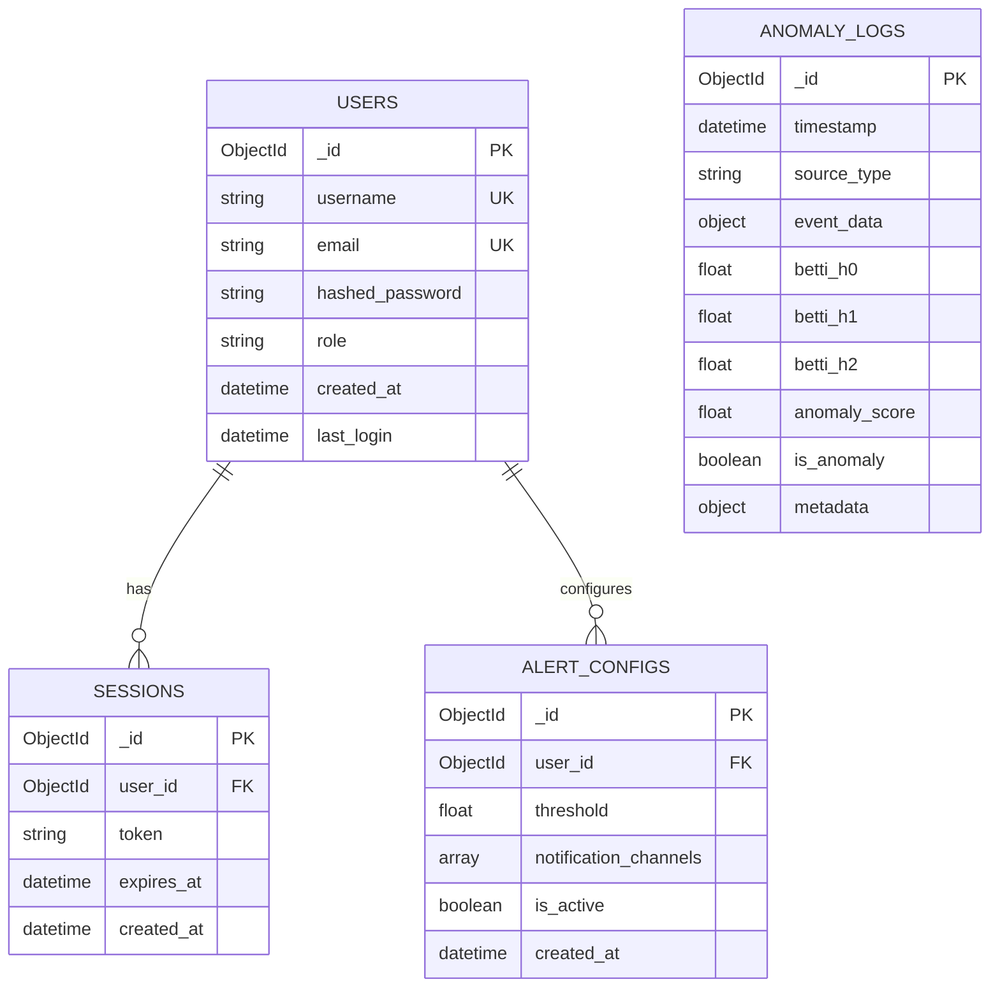

# TopoForge Database Schema Documentation

**Document Version:** 1.0  
**Date:** January 10, 2026  
**Author:** Team Member 3 - Testing & Documentation

---

## Overview

This document describes the MongoDB database structure for the TopoForge anomaly detection platform. It includes Entity-Relationship diagrams, detailed collection specifications, validation rules, and administration procedures.

## Entity-Relationship Diagram



---

## Collection Details

### 1. Users Collection

**Collection Name:** `users`  
**Purpose:** Store user accounts and authentication information

| Field | Type | Attributes | Description |
|-------|------|------------|-------------|
| `_id` | ObjectId | PK, Required | Unique identifier |
| `username` | String | Unique, Required | Display name (3-30 chars) |
| `email` | String | Unique, Required | Contact email address |
| `hashed_password` | String | Required | Bcrypt-hashed password |
| `role` | String | Required | Role: 'admin' or 'viewer' |
| `created_at` | DateTime | Required | Account creation timestamp |
| `last_login` | DateTime | Optional | Last successful login |

**Indexes:**
- `{ "email": 1 }` (Unique)
- `{ "username": 1 }` (Unique)
- `{ "created_at": -1 }`

**Example Document:**
```json
{
  "_id": ObjectId("659d57a0b3e5a1b3c4d5e6f7"),
  "username": "analyst_01",
  "email": "analyst@example.com",
  "hashed_password": "$2b$12$eImiTXuWVxfM37uY4JANjQ...",
  "role": "viewer",
  "created_at": ISODate("2026-01-08T00:00:00Z"),
  "last_login": ISODate("2026-01-08T11:30:00Z")
}
```

---

### 2. Anomaly Logs Collection

**Collection Name:** `anomaly_logs`  
**Purpose:** Store detected anomalies and topological analysis results

| Field | Type | Attributes | Description |
|-------|------|------------|-------------|
| `_id` | ObjectId | PK, Required | Unique identifier |
| `timestamp` | DateTime | Required | Detection time |
| `source_type` | String | Required | Source: 'wikipedia', 'twitter', 'github' |
| `event_data` | Object | Required | Raw event data snapshot |
| `betti_h0` | Int | Required | 0th Betti number (Components) |
| `betti_h1` | Int | Required | 1st Betti number (Loops) |
| `betti_h2` | Int | Required | 2nd Betti number (Voids) |
| `anomaly_score` | Float | Required | Severity score (0.0 - 1.0) |
| `is_anomaly` | Boolean | Required | Classification flag |
| `metadata` | Object | Optional | Additional detection context |

**Indexes:**
- `{ "timestamp": -1, "source_type": 1 }` (Compound)
- `{ "is_anomaly": 1 }`
- `{ "anomaly_score": -1 }`

**Retention:** Documents expire after 90 days

**Example Document:**
```json
{
  "_id": ObjectId("659d5820b3e5a1b3c4d5e6f8"),
  "timestamp": ISODate("2026-01-08T11:30:45Z"),
  "source_type": "wikipedia",
  "event_data": {
    "title": "Quantum Computing",
    "user": "editor_name",
    "change_size": 1500,
    "diff_url": "https://..."
  },
  "betti_h0": 45,
  "betti_h1": 12,
  "betti_h2": 0,
  "anomaly_score": 0.92,
  "is_anomaly": true,
  "metadata": {
    "cluster_id": "cluster_123",
    "detection_latency_ms": 45,
    "model_version": "1.2.0"
  }
}
```

---

### 3. Sessions Collection

**Collection Name:** `sessions`  
**Purpose:** Maintain active user sessions for authentication

| Field | Type | Attributes | Description |
|-------|------|------------|-------------|
| `_id` | ObjectId | PK, Required | Unique identifier |
| `user_id` | ObjectId | FK, Required | Reference using Users collection |
| `token` | String | Unique, Required | Refresh token or session ID |
| `expires_at` | DateTime | Required | Expiration timestamp |
| `created_at` | DateTime | Required | Session creation time |

**Indexes:**
- `{ "user_id": 1 }`
- `{ "token": 1 }` (Unique)
- `{ "expires_at": 1 }` (TTL Index - expireAfterSeconds: 0)

**Example Document:**
```json
{
  "_id": ObjectId("659d5900b3e5a1b3c4d5e6f9"),
  "user_id": ObjectId("659d57a0b3e5a1b3c4d5e6f7"),
  "token": "eyJhbGciOiJIUzI1NiIsInR5cCI6IkpXVCJ9...",
  "expires_at": ISODate("2026-01-15T11:30:00Z"),
  "created_at": ISODate("2026-01-08T11:30:00Z")
}
```

---

### 4. Alert Configs Collection

**Collection Name:** `alert_configs`  
**Purpose:** Store user alert preferences and thresholds

| Field | Type | Attributes | Description |
|-------|------|------------|-------------|
| `_id` | ObjectId | PK, Required | Unique identifier |
| `user_id` | ObjectId | FK, Required | Reference to Users collection |
| `threshold` | Float | Required | Minimum score (0.0-1.0) to trigger |
| `notification_channels` | Array | Required | ['email', 'desktop', 'slack'] |
| `is_active` | Boolean | Required | Enable/disable alerts |
| `created_at` | DateTime | Required | Configuration creation time |

**Indexes:**
- `{ "user_id": 1 }`
- `{ "is_active": 1 }`

**Example Document:**
```json
{
  "_id": ObjectId("659d5950b3e5a1b3c4d5e6fa"),
  "user_id": ObjectId("659d57a0b3e5a1b3c4d5e6f7"),
  "threshold": 0.85,
  "notification_channels": ["email", "desktop"],
  "is_active": true,
  "created_at": ISODate("2026-01-08T11:30:00Z")
}
```

---

## Relationships

| From Collection | To Collection | Relationship Type | Foreign Key | Constraint |
|----------------|---------------|-------------------|-------------|------------|
| Sessions | Users | Many-to-One | user_id | Cascade Delete (Logic) |
| Alert_Configs | Users | One-to-One | user_id | Cascade Delete (Logic) |
| Anomaly_Logs | - | Independent | - | - |

---

## Field Types Reference

| MongoDB Type | Python Type | TypeScript Type | Description |
|--------------|-------------|-----------------|-------------|
| ObjectId | bson.ObjectId | string | 24-char hex string unique ID |
| String | str | string | UTF-8 text data |
| Int | int | number | 32-bit/64-bit integer |
| Float | float | number | IEEE 754 floating point |
| Boolean | bool | boolean | `true` or `false` |
| DateTime | datetime | Date | ISO 8601 UTC timestamp |
| Array | list | Array<T> | Ordered list of values |
| Object | dict | Record<K, V> | Nested BSON document |

---

## Data Validation Rules

TopForge employs Mongoose-style schema validation at the application level and JSON Schema validation at the MongoDB level regarding:

### Users Validation
```json
{
  "$jsonSchema": {
    "bsonType": "object",
    "required": ["username", "email", "hashed_password", "role"],
    "properties": {
      "username": {
        "bsonType": "string",
        "minLength": 3,
        "maxLength": 30,
        "description": "must be a string between 3 and 30 characters"
      },
      "email": {
        "bsonType": "string",
        "pattern": "^.+@.+$",
        "description": "must be a valid email address"
      },
      "role": {
        "enum": ["admin", "viewer"],
        "description": "can only be one of the enum values"
      }
    }
  }
}
```

### Anomaly Logs Validation
- **betti_h[0-2]**: Must be non-negative integers
- **anomaly_score**: Must be float between 0.0 and 1.0
- **source_type**: Must be one of prescribed sources

---

## Migration Scripts

### Initial Setup
```python
# scripts/init_db.py
async def init_db():
    # Create collections
    await db.create_collection("users")
    await db.create_collection("anomaly_logs")
    
    # Create indexes
    await db.users.create_index("email", unique=True)
    await db.users.create_index("username", unique=True)
    await db.anomaly_logs.create_index([("timestamp", -1), ("source", 1)])
    
    # Create admin user
    # ...
```

### Schema Upgrades
Versioning is handled in the `metadata` field or collection version tracking:
1. Back up existing data
2. Run transformation script
3. Verify integrity
4. Update application code

---

## Backup & Recovery

### Strategy
- **Automated**: MongoDB Atlas daily snapshots (retained 7 days)
- **Manual**: Weekly `mongodump` to external cold storage (S3)
- **Point-in-Time Recovery**: Enabled via Atlas oplog

### Recovery Procedure
```bash
# Restore from dump
mongorestore --uri="mongodb+srv://..." --archive=topoforge_backup_2026-01-10.gz --gzip
```
